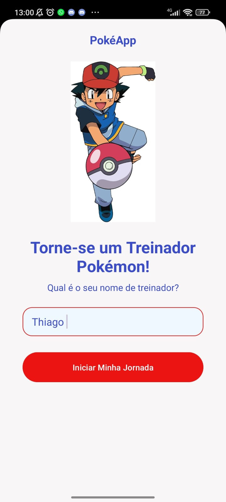
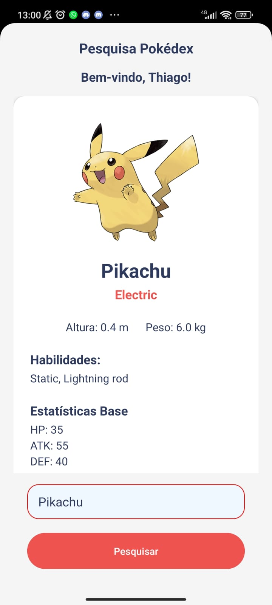

# 🐾 PokéApp

Um aplicativo Android moderno para explorar o mundo Pokémon! Pesquise seus Pokémon favoritos e descubra suas características, tipos, habilidades e muito mais.

## ✨ Funcionalidades

- 🔍 **Busca Inteligente**: Encontre Pokémon por nome ou número
- 📊 **Informações Detalhadas**: Veja tipos, altura, peso, habilidades e estatísticas
- 🖼️ **Imagens HD**: Visualize os Pokémon com arte oficial
- 👤 **Perfil de Treinador**: Personalize sua experiência com seu nome
- 🌐 **API Integrada**: Dados atualizados da PokéAPI

## 🚀 Como Usar

1. **Digite seu nome** na tela inicial
2. **Pesquise um Pokémon** digitando seu nome ou número
3. **Explore as informações** exibidas no card

## 🛠️ Tecnologias

- **Linguagem**: Java
- **Framework**: Android SDK
- **Bibliotecas**: Glide (imagens), CardView, RecyclerView
- **API**: PokéAPI (pokeapi.co)
- **Compatibilidade**: Android 7.0+ (API 24)

## 📱 Capturas de Tela

### Tela Inicial


### Pesquisa de Pokémon


## 🏃‍♂️ Executando o Projeto

### Pré-requisitos
- Android Studio Arctic Fox ou superior
- JDK 11+
- Dispositivo Android ou emulador

### Passos
1. Clone o repositório
2. Abra no Android Studio
3. Execute no dispositivo/emulador

```bash
./gradlew build
./gradlew installDebug
```

## 📂 Estrutura do Projeto

```
app/
├── src/main/java/com/example/pokedex/
│   ├── MainActivity.java          # Tela inicial
│   ├── PokedexActivity.java       # Tela de pesquisa
│   ├── Pokemon.java               # Modelo de dados
│   └── PokemonAdapter.java        # Adapter para lista
├── src/main/res/
│   ├── layout/                    # Layouts XML
│   ├── values/                    # Strings e cores
│   └── drawable/                  # Imagens e ícones
└── build.gradle.kts               # Configuração Gradle
```

## 🤝 Contribuição

Contribuições são bem-vindas! Sinta-se à vontade para abrir issues e pull requests.

## 📄 Licença

Este projeto é para fins educacionais e de demonstração.
